# PiPjumper

**Tiny tray tool to make Picture-in-Picture window jump away from mouse pointer**

[](https://opensource.org/licenses/MIT)
[](https://github.com/ZalgoSoft/pipjumper)

## Overview

PiPjumper is a lightweight utility that automatically moves Picture-in-Picture windows away from your mouse cursor, preventing accidental clicks or interference while watching videos. It runs quietly in the system tray with minimal resource usage.

## Features

- **Auto-jump**: PIP window automatically jumps to a random position within the work area when you approach it
- **Click-through mode**: Makes the PIP window transparent (16 alpha) and moves it off-screen (outside virtual desktop), allowing clicks to pass through
- **Transparency control**: Scroll mouse wheel over the PIP window to adjust transparency in 16-step increments (range: 16-255)
- **Hotkey**: `Ctrl+Shift+P` to cycle through modes
- **Temporary disable**: Hold `Alt` key to temporarily disable jumping (when in Enabled mode)
- **System tray menu**: Quick mode switching, About dialog, and Exit
- **DPI-aware**: Automatically adapts to high-DPI displays using `SetProcessDpiAwarenessContext` (Windows 10+) or fallback to `SetProcessDPIAware`
- **Pure Win32 API**: Written entirely in C without external libraries
- **Statically linked**: No runtime dependencies, works out-of-the-box on any Windows system
- **Low memory footprint**: ~200KB executable size, minimal resource usage
- **Scan interval**: Optimized 500ms scanning with 200ms cooldown to prevent excessive jumps

## Modes

| Mode | Tray Icon | Description |
|------|-----------|-------------|
| **Enabled** | ℹ️ | PIP window jumps to random position when mouse approaches (24px padding from screen edges) |
| **Click-through** | ❓ | PIP window becomes semi-transparent (16 alpha) and moves off-screen, allowing clicks to pass through to underlying windows |
| **Disabled** | ⚠️ | All functionality temporarily suspended |

## Demo



## System Requirements

| Windows Version | Support Level | Notes |
|-----------------|---------------|-------|
| Windows 11 (22H2+) | ✅ Full | Complete DPI awareness support |
| Windows 10 (1703+) | ✅ Full | Complete DPI awareness support |
| Windows 10 (1607 and earlier) | ✅ Supported | Limited DPI awareness (fallback) |
| Windows 8.1 | ✅ Supported | Basic functionality |
| Windows 7 SP1 | ✅ Supported | Basic functionality |
| Windows Vista | ⚠️ Limited | May work but untested |
| Windows XP | ❌ Not supported | Missing required APIs |

## Installation

### Pre-built Binaries
1. Download the latest release from [GitHub Releases](https://github.com/ZalgoSoft/pipjumper/releases)
2. Extract the archive
3. Run `pipjumperx86.exe` (32-bit) or `pipjumperx64.exe` (64-bit) depending on your system

### Build from Source

#### Prerequisites
- Visual Studio Build Tools or Visual Studio IDE (2022 or later)
- Windows SDK

#### Build Steps
1. Open **Visual Studio Developer Command Prompt**
2. Navigate to the project directory
3. Run:
   ```batch
   build.bat
   ```
4. The script automatically detects your architecture (x86/x64) and builds the appropriate executable

The build process uses:
- **Compiler**: Microsoft C/C++ Optimizing Compiler
- **Optimization**: `/O1` for small code size, `/GL` (x64) for whole program optimization
- **Linking**: `/NODEFAULTLIB` (no CRT dependencies), `/LTCG` (x64) for link-time code generation
- **Entry point**: `EntryPoint` (no CRT initialization)

## Usage

1. Run `pipjumperx64.exe` or `pipjumperx86.exe`
2. The application appears in the system tray (notification area)
3. Right-click the tray icon to access the menu:
   - **Enabled** - Default mode: PIP window jumps away from mouse
   - **Click through** - PIP window becomes transparent and moves off-screen
   - **Disabled** - Temporarily disable all functionality
   - **About** - Display version and support information
   - **Exit** - Close the application

### Controls

| Action | Effect |
|--------|--------|
| `Ctrl+Shift+P` | Cycle through modes (Enabled → Click-through → Disabled → Enabled) |
| Hold `Alt` | Temporarily disable jumping (when in Enabled mode) |
| Mouse wheel over PIP | Adjust transparency (when in Enabled mode): 16 alpha steps per scroll tick |
| Double-click tray icon | Cycle through modes |
| Right-click tray icon | Open context menu |

### Transparency Adjustment Details
- **Scroll up**: Increases transparency (less transparent, max 255)
- **Scroll down**: Decreases transparency (more transparent, min 16)
- The PIP window automatically gains `WS_EX_LAYERED` style if not already set
- Changes are applied in real-time without restarting

## Supported Browsers/Applications

PiPjumper detects Picture-in-Picture windows by analyzing:

### Window Class Names (case-insensitive)
- `MozillaDialogClass` (Firefox)
- `MozillaCompositorWindowClass` (Firefox)
- `Chrome_WidgetWin` (Chrome, Edge, Opera, Brave, and other Chromium-based browsers)

### Window Titles (case-insensitive)
- Contains "picture-in-picture"
- Contains "picture in picture"

### Additional Detection Criteria
- Must have `WS_EX_TOPMOST` style (always on top)
- Must **not** have maximize or minimize boxes (`WS_MAXIMIZEBOX`, `WS_MINIMIZEBOX`)
- Must be visible and not be the main application window

## Technical Details

- **Language**: Pure C with Win32 API
- **Hooking**: Low-level mouse hook (`WH_MOUSE_LL`) for real-time cursor tracking
- **Randomization**: Custom XORShift PRNG for window positioning (no CRT dependency)
- **Virtual Desktop**: Supports multi-monitor setups via `SM_XVIRTUALSCREEN`/`SM_YVIRTUALSCREEN`
- **Window Management**:
  - Random positioning within work area (24px padding)
  - 200ms cooldown between jumps on same window
  - Async window positioning (`SWP_ASYNCWINDOWPOS`) for smooth performance
- **Transparency**: Uses `SetLayeredWindowAttributes` with `LWA_ALPHA` flag
- **Tray**: Native Windows notification area with tooltip hints
- **String Operations**: Custom implementations of `memset`, `memcpy`, and case-insensitive string functions (no CRT)

### Architecture

```
┌─────────────────────────────────────┐
│      System Tray Icon (Hidden)      │
│         NotifyIcon Callbacks        │
└──────────────┬──────────────────────┘
               │
┌──────────────▼──────────────────────┐
│         Main Window (Hidden)        │
│   - Message Pump                    │
│   - Timer (500ms scan)              │
│   - Hotkey handling (Ctrl+Shift+P)  │
└──────────────┬──────────────────────┘
               │
┌──────────────▼──────────────────────┐
│      Low-Level Mouse Hook           │
│   - Tracks cursor position          │
│   - Detects PIP under cursor        │
│   - Processes mouse wheel events    │
└─────────────────────────────────────┘
```

## Performance Characteristics

- **CPU Usage**: ~0% when idle, minimal during cursor movement
- **Memory**: ~2-4 MB working set
- **Scan Interval**: 500ms (reduces unnecessary processing)
- **Jump Cooldown**: 200ms (prevents flickering)
- **Startup Time**: Instant (< 50ms)

## Building Requirements

The build script (`build.bat`) requires:

- **Visual Studio 2022 or later** (Build Tools or full IDE)
- **Windows SDK** (included with Visual Studio)
- Running from **Visual Studio Developer Command Prompt**

### Build Outputs

| Architecture | Output File | Size (approx) |
|--------------|-------------|---------------|
| x86 (32-bit) | `pipjumperx86.exe` | ~190 KB |
| x64 (64-bit) | `pipjumperx64.exe` | ~210 KB |

### Compiler Flags

#### x86 Build
- `/O1` - Optimize for size
- `/GS-` - No security checks (minimal overhead)
- `/Gy` - Enable function-level linking
- `/Gw` - Optimize global data
- `/Oi-` - Disable intrinsic functions

#### x64 Build
- `/O1` - Optimize for size
- `/GS-` - No security checks
- `/GL` - Whole program optimization
- `/Gy` - Enable function-level linking
- `/Gw` - Optimize global data
- `/LTCG` - Link-time code generation

## Version Information

- **Current Version**: 1.1
- **Build Date**: 07.09.2026
- **Tooltip Help**: `Ctrl+Shift+P` | Hold `Alt`: temporarily disable jumping | Mouse scroll: change PIP transparency

## License

This project is open source. Feel free to contribute, report issues, or suggest improvements on [GitHub](https://github.com/ZalgoSoft/pipjumper).

## Contributing

1. Fork the repository
2. Create a feature branch
3. Make your changes
4. Test with both x86 and x64 builds
5. Submit a pull request

## Support

- GitHub Issues: [https://github.com/ZalgoSoft/pipjumper/issues](https://github.com/ZalgoSoft/pipjumper/issues)
- Source Code: [https://github.com/ZalgoSoft/pipjumper](https://github.com/ZalgoSoft/pipjumper)

---

*Built with ❤️ for better video watching experience*
